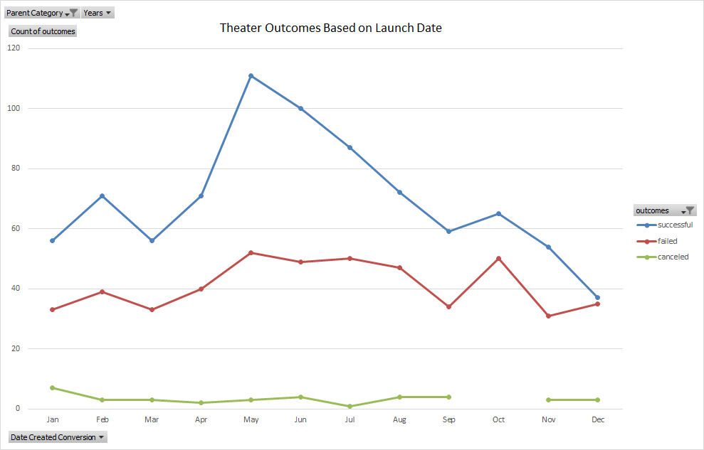
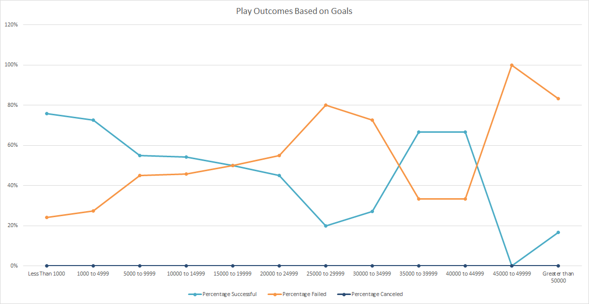

# Kickstarting with Excel

## Overveiw of Project
This is an Analysis of Kickstarter Campaign Outcomes with regard to their Launch Dates and Funding Goals.
### Purpose
The purpose of this report is to provide Louise with data so she can understand how well her play performed compared to others based on Launch Date and Funding Goals.
## Analysis and Challenges

### Analysis of Outcomes Based on Launch Date

This is a Pivot Chart of Theater Kickstarters, from 2009 through 2016, by month, based on how many were successful, failed or canceled. This is acheived by charting the success, failure and cancelation of each Theater Kickstarter, then comparing when each project began or Launched, to determine if there is a correlation between the Outcome and Launch Date for each project.

### Analysis of Outcomes Based on Goals

This chart illustrates the percentage of successful, failed, and canceled Play Kickstarters, from 2009 through 2016, based on their Funding Goals. To acheive this we sort the Play Kickstarters by their Funding Goals, then determine the percentage of successful, failed and canceled outcomes for each range of Funding Goals. 

### Challenges and Difficulties Encountered
The only significant challenge I experienced was with deliverable 2. When building the formula to deterrmine how many plays were successful, failed, or canceled, I initially used > or < instead of >= or <=. This problem became apparent when I built the chart and it didn't match the example.

## Results

- What are two conclusions you draw about the Outcomes based on Launch Date?
1. May Launch Dates have had the most success for Theater Kickstarts.
2. December Launch Dates have resulted in the least number of auccessful Theater Kickstarters.

- What can you conclude about the Outomes based on Goals?
The lower two ranges of Funding Goals have the highest percentages of success.

- What are some limitations of this dataset?
If there was timestamp and amount data for each pledge, we could look at the pledging patterns over the course of each Kickstarter.

- What are some other possible tables and/or graphs that we could create?
Charting the totals with the percentages for deliverable 2 would demonstrate the relevance of the percentages for each range of Funding Goals.
